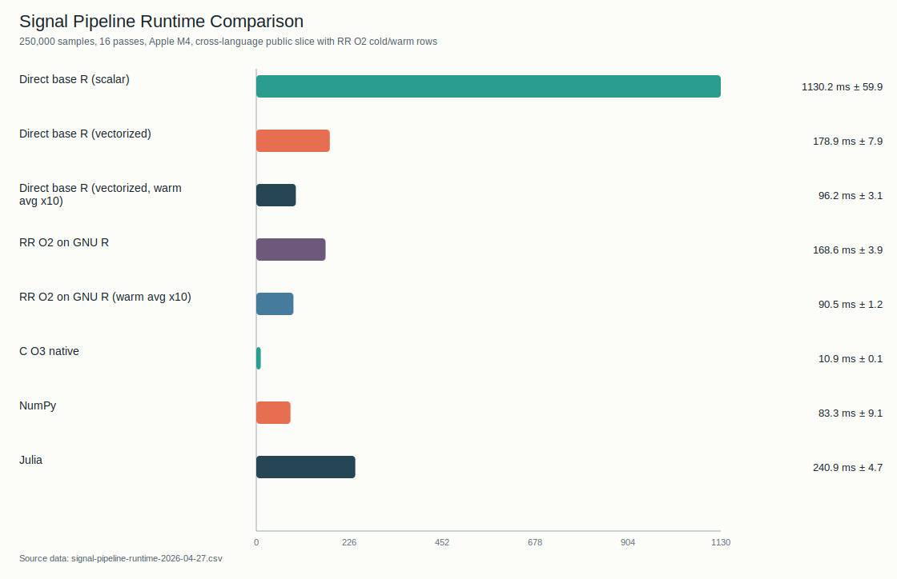
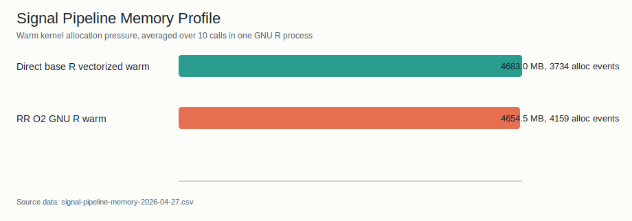
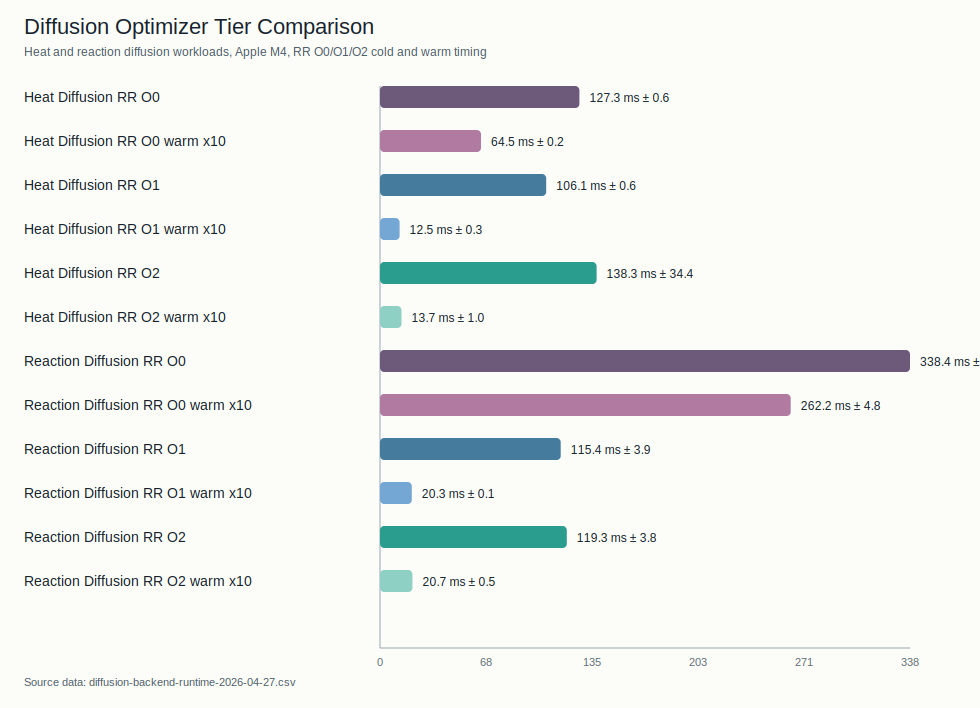
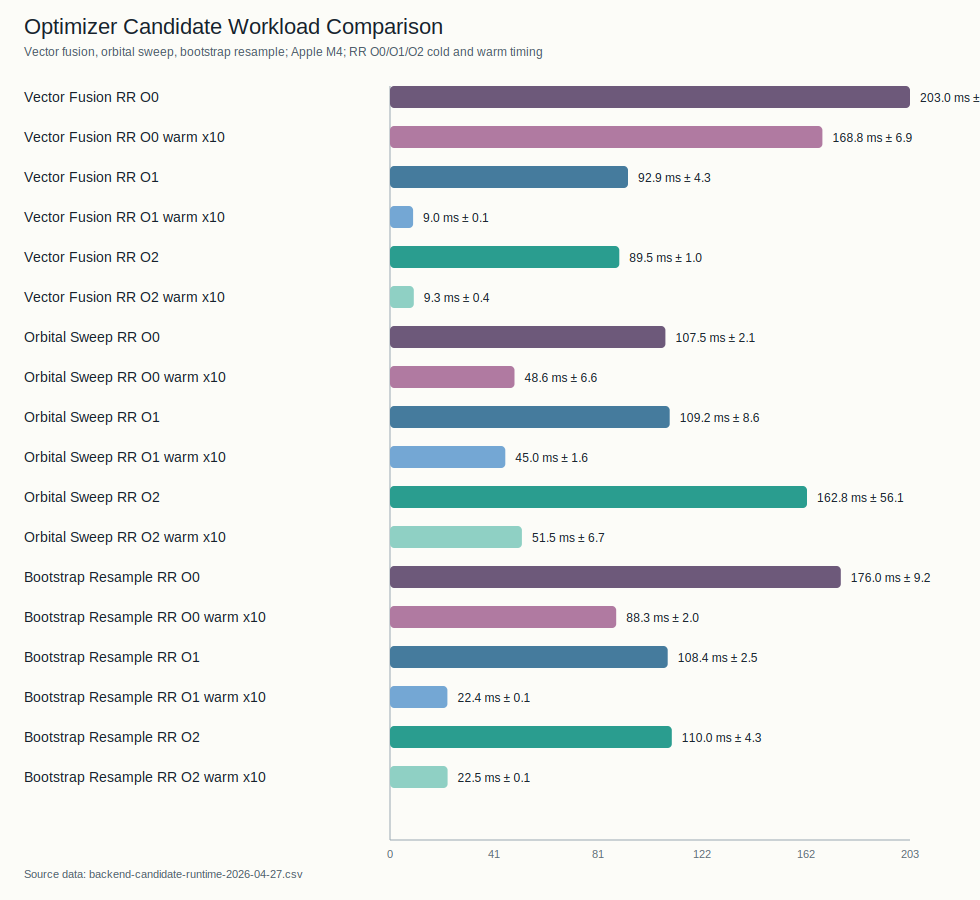

# Tachyon Engine

This page is the optimizer manual for RR.

Primary implementation entrypoint:

- `src/mir/opt.rs`

## Audience

Read this page when you need to know:

- why a loop vectorized or skipped
- which pass family owns a rewrite
- what Tachyon considers safe enough to do

## Design Goals

Tachyon is not a speculative “make R fast somehow” pass stack.

Its goals are:

- preserve RR program meaning
- exploit proofs already available in MIR
- emit simpler and more idiomatic R when safe
- keep compile time bounded on large workloads

## Mental Model

Tachyon is not "just pattern matching".

The optimizer has two broad layers:

1. general MIR analysis/simplification passes
   - SCCP
   - GVN/CSE
   - simplify
   - DCE
   - BCE
   - LICM
   - inlining
   - de-SSA
2. proof-driven structural rewrites that are much more pattern-sensitive
   - vectorization
   - reduction rewrites
   - selected scatter/gather/call-map forms

So when a user says "my loop did not optimize", the answer is not always
"the pattern failed". Sometimes the general passes still ran and improved the
program, but the pattern-sensitive layer correctly skipped because the final MIR
shape was not provable enough.

## Safety Rules

Tachyon prefers a clean skip to a risky rewrite.

Important rules:

- no guard elimination without proof
- no phi-sensitive codegen paths after de-SSA
- no vectorization when loop-carried state is ambiguous
- no reduction when the loop carries extra non-accumulator state
- no helper rewrite that changes scalar/vector semantics
- no post-emission raw text rewrite inside functions that contain
  `unsafe r { ... }`

`unsafe r { ... }` is an optimizer barrier for raw user R. It is not the same as
Rust `unsafe` inside the compiler implementation; see
[Unsafe Boundaries](unsafe-boundaries.md) for the compiler-side policy and
current trust boundary. The default form is read/write from the optimizer's
point of view: the containing function is conservative and visible
function-frame locals are reloaded after the block. The narrower
`unsafe r(read) { ... }` form is a no-write promise: it still blocks raw text
rewrites for emitted output containing the escape, but it does not force opaque
interop or post-block RR-local reloads.

Helper rewrite scanners are required to be monotonic over a line or expression:
when an earlier candidate is dynamic or otherwise not rewriteable, the scanner
must skip that candidate and continue looking for later rewriteable helper calls.
This keeps raw R cleanup deterministic and prevents one unsafe `rr_index1_*`,
`rr_field_get`, or `rr_named_list` occurrence from blocking an independent
literal helper cleanup later in the same emitted line.

## Optimization Levels

- `-O0`
  - stabilization only
  - still performs mandatory helper canonicalization and de-SSA
- `-O1`
  - optimizing pipeline with the `Balanced` heavy-tier schedule
- `-O2`
  - optimizing pipeline with adaptive heavy-tier phase ordering
  - currently chooses between `Balanced`, `ComputeHeavy`, and
    `ControlFlowHeavy` schedules per function
- `-O3`
  - opt-in aggressive mode with larger bounded budgets, more inline rounds,
    and experimental pass groups available to balanced plans
- `-Oz`
  - size-oriented mode using the balanced schedule, no experimental pass group,
    and no full-program inline tier

## Program-Level Strategy

Tachyon uses a tiered budget model.

The adaptive budget planner treats empty/no-MIR programs as zero-density
programs. Their hot-operation density contributes `0` to the budget score, so
`-O2` can still emit a stable helper-only artifact without dividing by an empty
IR total.

### Tier A: Always

Run low-cost, safe canonical passes on every eligible function.

### Tier B: Selective Heavy

Run heavier per-function optimization only on budget-selected targets.

### Tier C: Full-Program Inline

Run bounded interprocedural inlining only when the heavy tier is active.

### Chronos Pass Manager

Chronos is the internal pass manager for MIR optimization stage boundaries. It
does not make the optimizer more speculative; it makes pass order, timing,
verification labels, proof keys, and analysis invalidation explicit at the point
where a pass is run.

Current Chronos-owned slices include:

- function-entry floor-index metadata/canonicalization
- always-tier function passes
- phase-order standard, structural, fast-dev vectorization, and cleanup clusters
- cross-function SROA record call/return specialization before heavy tier
- full-program inlining rounds
- post-inline cleanup
- fresh-alias cleanup
- post-de-SSA cleanup
- prepare-for-codegen cleanup

Chronos tracks invalidated analysis families such as control-flow, value graph,
loop, alias, SSA-form, and record-shape facts. This metadata is a review and
future-caching boundary; changed passes actively invalidate their declared
families, and downstream code must not reuse stale analysis results across that
boundary. The first production cache is intentionally narrow: Chronos reuses
loop discovery and derived phase features for stage gate decisions, and the
Chronos path also passes the cached loop view into loop-sensitive rewrites such
as `LoopOpt`, `LICM`, `Poly`, `Vectorize`, `BCE`, and `FreshAlloc`. The cache
is cleared when a changed pass invalidates the relevant analysis family.

Post-inline cleanup is intentionally more than CFG repair. Inlining can expose
plain scalar expressions that did not exist during the earlier per-function
SCCP/Simplify pass. Chronos therefore runs bounded SROA, SCCP, Simplify, and DCE
after successful program inlining so newly visible scalar constants are folded
before R emission.

The current Chronos catalog coverage and remaining legacy optimizer slices are
tracked in
[proof/README.md#chronos-pass-catalog-audit](https://github.com/Feralthedogg/RR/blob/main/proof/README.md#chronos-pass-catalog-audit).

### Hermes Emit Pass Manager

Raw emitted-R rewrites are intentionally outside Chronos because they operate
after MIR has already been rendered to R text. Hermes is the source-emission
backend pass manager for this layer. It keeps the previous
fragment/full-program/post-assembly order intact, makes the `preserve_all_defs`
pruning gate explicit, and keeps unsafe R escape blocks out of text rewriting.

Hermes is an orchestration and review boundary, not a MIR semantic proof. Its
current claim boundary is tracked in
[proof/README.md#hermes-raw-rewrite-pass-catalog-audit](https://github.com/Feralthedogg/RR/blob/main/proof/README.md#hermes-raw-rewrite-pass-catalog-audit).

### Peephole Stage Catalog

The emitted-R peephole pipeline is also outside Chronos. It now has a compiled
`PeepholePassManager` and stage catalog that mirror the existing
`PeepholeProfile` timing boundaries:
linear scan, primary flow/inline/reuse/loop cleanup, standard-mode secondary
cleanup, and final line-map/text repair. This is a metadata boundary first; the
primary flow, primary inline, primary reuse, primary loop cleanup, and
finalization now have stage-owned entrypoints. Standard-mode secondary inline,
exact, helper cleanup, record SROA, and finalize cleanup also have
profile-preserving stage-owned entrypoints. `secondary_record_sroa` now has an
independent profile field while the historical helper-cleanup total remains a
compatibility aggregate. Remaining work is now substage-level refinement, not a
top-level peephole stage boundary gap.

The current peephole claim boundary is tracked in
[proof/README.md#peephole-stage-catalog-audit](https://github.com/Feralthedogg/RR/blob/main/proof/README.md#peephole-stage-catalog-audit).

## Core Pass Families

### Canonicalization

- helper call rewrites
- index-floor canonicalization
- wrap/cube helper normalization
- simplification after structural rewrites

### Scalar Analysis and Simplification

- SCCP
- GVN/CSE
- simplify
- DCE
- BCE
- LICM

These are not merely pre-processing helpers. They are substantive optimization
passes in their own right, and they often produce the facts or MIR cleanup that
later pattern-sensitive passes rely on.

Constant folding uses the shared MIR numeric evaluator. Integer arithmetic is
checked: non-overflowing constants may fold, while overflow-sensitive expressions
stay in MIR for R runtime evaluation rather than adopting host integer overflow
semantics.

### Structural Transformations

- inlining
- TCO
- de-SSA

Aggregate scalar replacement is tracked separately:

- [MIR SROA Design](sroa.md), for record/list aggregate scalar replacement

The current SROA gate is intentionally narrow but production-backed: optimized
trait/operator record chains should lower through deterministic scalar temps,
and unrelated vector stores must not disable scalarization for independent
record candidates. The perf gate includes a trait/SROA compile-shape slice so
future changes do not silently lose cross-call scalar field lowering, reintroduce
record-return helper calls, or grow AST/output size in that hot path. This is
not a general multi-return ABI: unsupported whole-record consumers still
materialize records at the boundary.

Polyhedral conditional-validity checks are also deliberately conservative in
process. RR may record conditional-validity candidates for diagnostics and
future out-of-process validation, but linked in-process ISL scheduling uses the
normal constraint path and treats conditional-validity failures as optimizer
misses. Availability of that optional ISL path must not affect source semantics.

### Vectorization and Reduction

Implemented pattern families include:

- map
- conditional map
- expr-map
- multi-output expr-map
- call-map
- scatter-map
- shifted map
- recurrence add-constant
- reduction (`sum/prod/min/max`)
- selected 2D row/column map and reduction
- selected 3D map/expr-map/call-map/scatter-map/reduction/shift forms

### Outlining

MIR outlining is a bounded O2/O3 program pass. Its purpose is compile-budget and
cache-shape control, not arbitrary hot-path tuning.

The current implementation is conservative:

- it skips functions that already start with `__rr_outline_`
- it skips functions that require conservative optimization, including opaque
  unsafe/raw-R regions
- it only extracts supported assign-only regions from linear blocks, branch
  arms, or canonical loop bodies
- it limits live-in and live-out values so helper signatures stay reviewable
- generated helper names use the internal `__rr_outline_...` prefix and are not
  part of the stable emitted-R naming contract

Default thresholds:

| Level | Parent IR | Region IR | Live-ins | Live-outs |
| --- | ---: | ---: | ---: | ---: |
| `-O2` | 1200 | 140 | 8 | 4 |
| `-O3` | 900 | 90 | 12 | 4 |

Branch and loop regions have separate threshold knobs because they have
different code-shape tradeoffs.

### Loop Unrolling

Loop unrolling is a bounded O2/O3 function pass that runs after the optimizer
has had a chance to vectorize or use polyhedral transforms. It is intentionally
limited to simple counted loops:

- one recoverable induction variable
- constant trip count
- single body block and single exit
- no unsafe raw-R block in the loop body
- no phi-dependent value tree inside the unrolled body

Small loops are fully unrolled. Larger constant-trip loops may be partially
unrolled when the trip count is divisible by the selected factor and the IR
growth budget allows it.

Default full-unroll trip limits:

- `-O2`: up to 8
- `-O3`: up to 16

### Optimization Fuel

Tachyon uses per-function optimization fuel to keep expensive pass sequences
bounded. Fuel exhaustion is a compile-budget event, not a compiler error:
remaining heavy or structural work for the affected function is skipped, and
verification/codegen continue normally.

Default function budgets:

- fast-dev: `ir_size * 120`, clamped to `10_000..=120_000`
- standard/O2: `ir_size * 400`, clamped to `50_000..=500_000`
- O3: `ir_size * 800`, clamped to `120_000..=2_000_000`

Fuel, outlining, and unrolling all participate in the optimized-MIR cache
fingerprint so environment changes do not create stale cache hits.

## What Tachyon Will Not Do

Tachyon remains conservative on:

- arbitrary nested-loop scheduling
- branch-merged indirect scatter with weak proof
- non-canonical bound reconstruction
- loop-carried state that cannot be reconstructed safely

When in doubt, the pass should skip.

## Reading Rule

This page describes optimizer policy, not a promise that every syntactically
similar program will optimize the same way. Proof availability still decides.

## Vectorization Diagnostics

CLI summary reports:

- `Vectorized`
- `Reduced`
- `Simplified`
- `VecSkip`

`VecSkip` is grouped by dominant reject reason:

| Reason | Meaning |
| --- | --- |
| `no-iv` | the loop did not expose one recoverable induction variable |
| `bound` | the trip count or loop bound was not canonical enough to prove safely |
| `cfg` | the loop CFG shape exceeded the currently supported matcher forms |
| `indirect` | the loop used indirect index access that RR could not prove safe to rewrite |
| `store` | the loop had store side effects that block the current vector rewrite families |
| `no-pattern` | the loop was analyzable, but it did not match any supported vector plan |

## Related Manuals

- [Writing RR for Performance and Safety](../writing-rr.md)
- [Compiler Pipeline](pipeline.md)
- [MIR SROA Design](sroa.md)
- [Compatibility and Limits](../compatibility.md)

Use `RR_VECTORIZE_TRACE=1` to see per-loop matcher decisions.

## Cost Model

Tachyon uses a cost model rather than blindly preferring helper-heavy lowering.

Current inputs include:

- loop trip count hints
- helper count and helper family cost
- whole-destination vs partial-range writes
- shadow-state penalties
- direct builtin vector-call opportunities

The main idea is simple:

- prefer direct whole-vector R when it is provably available
- prefer helper-based vector lowering when it reduces loop work and keeps meaning
- prefer scalar fallback when helper overhead dominates

## Runtime-Aware Lowering

Selected vector call paths lower through runtime helpers such as:

- `rr_call_map_whole_auto(...)`
- `rr_call_map_slice_auto(...)`

These helpers may choose scalar fallback or vector evaluation at runtime based
on trip count and helper cost.

Related knobs:

- `RR_VECTOR_FALLBACK_BASE_TRIP`
- `RR_VECTOR_FALLBACK_HELPER_SCALE`

## Backend-Aware Fusion

Backend-aware lowering only pays off when the hot path stays on the
backend-aware path end to end.

The current benchmark slices below are the clearest cautionary example:

- plain emitted R stays close to idiomatic vectorized GNU R
- `-O1/-O2` need to justify themselves through generic MIR/vectorization wins,
  not backend-specific special cases

The important week-1 change is that the benchmark scripts now also record
optimizer diagnostics for RR artifacts:

- emitted line count and helper residue (`repeat`, `for`, `rr_index1_*`,
  `rr_call_map_*`)
- `TachyonPulseStats` summaries for matched/applied vector plans
- trip-tier and call-map lowering counts

The practical rule is:

- do not assume primitive-by-primitive wrappers are enough
- compare `-O0/-O1/-O2` first and only widen the matrix when a backend path is
  still demonstrably alive
- tie every performance claim back to emitted-shape and pulse diagnostics

<!-- BEGIN GENERATED BENCHMARK SNAPSHOT -->
### Benchmark Snapshots

Refreshed with `scripts/refresh_benchmark_assets.sh --date 2026-04-27 --skip-renjin`.

#### Signal Pipeline Public Slice

[CSV](../assets/signal-pipeline-runtime-2026-04-27.csv) · [SVG](../assets/signal-pipeline-runtime-2026-04-27.svg)



- RR O2 on GNU R: `168.6 ms` cold / `90.5 ms` warm
- direct vectorized GNU R baseline: `178.9 ms` cold / `96.2 ms` warm
- NumPy: `83.3 ms`; C O3 native: `10.9 ms`
- emitted RR O2 artifact on this snapshot: `77` lines, `1` repeat loop, `4` vectorized loops

#### Signal Pipeline Memory Slice

[CSV](../assets/signal-pipeline-memory-2026-04-27.csv) · [SVG](../assets/signal-pipeline-memory-2026-04-27.svg)



- RR O2 GNU R warm allocation pressure: `4654.523 MB` across `4159` Rprofmem allocation events
- direct vectorized GNU R warm allocation pressure: `4683.003 MB` across `3734` Rprofmem allocation events
- memory rows are Rprofmem allocation-pressure snapshots, not a portable exact GC-count guarantee

Nightly CI also publishes the same memory-profile shape as the
`nightly-signal-pipeline-benchmark-report` artifact. The job is intentionally
nightly-only so regular PR CI does not become a benchmark-flake gate.

#### Diffusion Optimizer Slice

[CSV](../assets/diffusion-backend-runtime-2026-04-27.csv) · [SVG](../assets/diffusion-backend-runtime-2026-04-27.svg)



- useful `-O2` reference points: `138.3 ms` / `13.7 ms` for `heat_diffusion` cold/warm and `119.3 ms` / `20.7 ms` for `reaction_diffusion` cold/warm

| Workload | O0 ms | O1 ms | O2 ms | O0/O1 | O0/O2 |
| --- | ---: | ---: | ---: | ---: | ---: |
| `heat` | `127.3 (0.6)` | `106.1 (0.6)` | `138.3 (34.4)` | `1.20x` | `0.92x` |
| `reaction` | `338.4 (54.8)` | `115.4 (3.9)` | `119.3 (3.8)` | `2.93x` | `2.84x` |

#### Optimizer Candidate Slice

[CSV](../assets/backend-candidate-runtime-2026-04-27.csv) · [SVG](../assets/backend-candidate-runtime-2026-04-27.svg)



| Workload | O0 ms | O1 ms | O2 ms | O0/O1 | O0/O2 |
| --- | ---: | ---: | ---: | ---: | ---: |
| `bootstrap` | `176.0 (9.2)` | `108.4 (2.5)` | `110.0 (4.3)` | `1.62x` | `1.60x` |
| `orbital` | `107.5 (2.1)` | `109.2 (8.6)` | `162.8 (56.1)` | `0.98x` | `0.66x` |
| `vector` | `203.0 (8.8)` | `92.9 (4.3)` | `89.5 (1)` | `2.19x` | `2.27x` |

Notes:

- `bootstrap_resample` gets most of its gain at `-O1`; `-O2` is still ahead of `-O0`, but not the best point on this snapshot.
- `orbital_sweep` is effectively flat on this snapshot, with warm `-O1/-O2` at `45.0 ms` and `51.5 ms`.
- `vector_fusion` splits cold and warm leadership: `-O2` is best cold, while `-O1` stays better on the warm path.
- Renjin rows were skipped for this snapshot.
<!-- END GENERATED BENCHMARK SNAPSHOT -->

The inverse rule matters just as much:

- do not assume every backend-looking kernel should become a fused backend helper
- already-compact emitted vector R can still be the best answer
- irregular gather-heavy kernels may flatten out or regress even after fusion

The optimizer-candidate slice above shows both sides:

- `bootstrap_resample` gets a real generic-tier win, but the current best point is `-O1`, not `-O2`
- `orbital_sweep` stays roughly flat, so backend-aware shaping is not buying much there
- `vector_fusion` only moves modestly after `-O1`, which is the reminder that the emitted vector R was already close to the useful shape

Tachyon should therefore prefer fewer backend crossings with larger,
proof-backed kernels over many small “technically native” calls, but only when
the resulting kernel still matches the actual cost shape of the workload.

## Reduction Rules

Reductions are intentionally narrower than maps.

A reduction candidate must not rely on:

- ambiguous loop-local state
- unstable loop-local state
- extra non-accumulator loop state
- accumulator self-reference hidden inside the candidate RHS

This is the main barrier against “closed-form” miscompiles in stateful loops.

## Debugging Tachyon

Use:

```bash
RR_VECTORIZE_TRACE=1 target/debug/RR file.rr -o out.R -O2 --no-incremental
RR_VERIFY_EACH_PASS=1 target/debug/RR file.rr -o out.R -O2 --no-incremental
RR_MIR_DUMP_DIR=target/mir-dumps RR_MIR_DUMP_FILTER=main RR_MIR_DUMP_WHEN=both \
  target/debug/RR file.rr -o out.R -O3 --no-incremental
```

Compile profiles now include Tachyon pass decisions and optimization
opportunity estimates. These entries record the pass contract, required and
invalidated analysis families, proof key, enablement decision, and whether the
pass changed MIR. Hot-count input can be supplied with `--profile-use <file>` or
`RR_PROFILE_USE`; supported profile lines are `name=count`, `name: count`, and
`name count`.

Useful companion references:

- [Compiler Pipeline](pipeline.md)
- [Runtime and Error Model](runtime-and-errors.md)
- [Testing and Quality Gates](testing.md)
