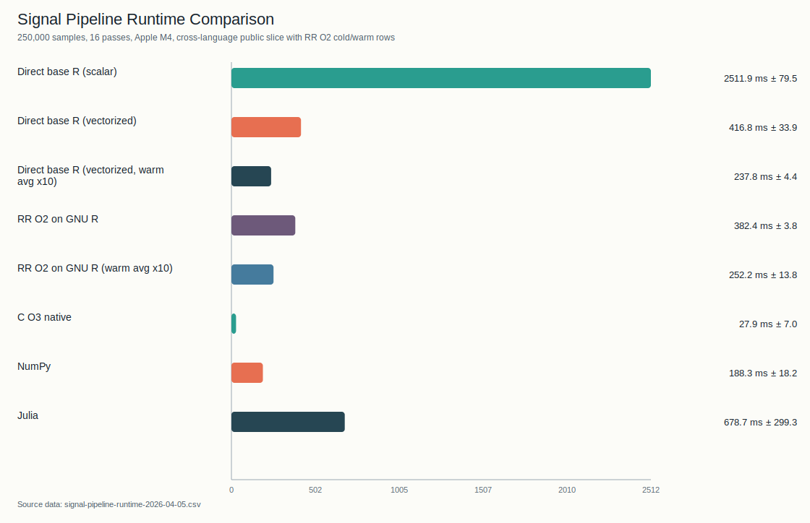
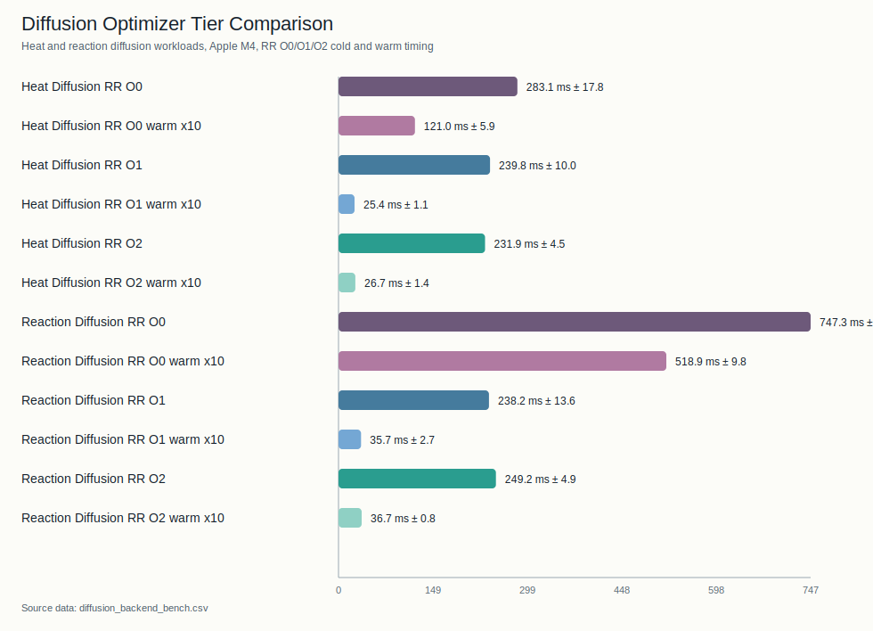
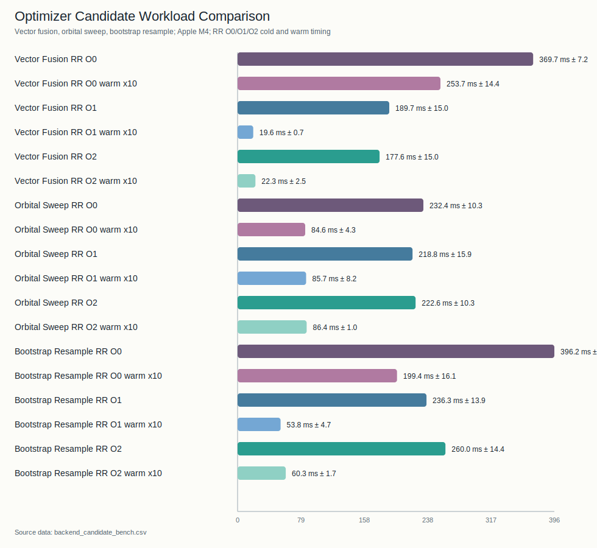

# Tachyon Engine

This page is the optimizer manual for RR.

Primary implementation entrypoint:

- `src/mir/opt.rs`

## Audience

Read this page when you need to know:

- why a loop vectorized or skipped
- which pass family owns a rewrite
- what Tachyon considers safe enough to do

## Design Goals

Tachyon is not a speculative “make R fast somehow” pass stack.

Its goals are:

- preserve RR program meaning
- exploit proofs already available in MIR
- emit simpler and more idiomatic R when safe
- keep compile time bounded on large workloads

## Mental Model

Tachyon is not "just pattern matching".

The optimizer has two broad layers:

1. general MIR analysis/simplification passes
   - SCCP
   - GVN/CSE
   - simplify
   - DCE
   - BCE
   - LICM
   - inlining
   - de-SSA
2. proof-driven structural rewrites that are much more pattern-sensitive
   - vectorization
   - reduction rewrites
   - selected scatter/gather/call-map forms

So when a user says "my loop did not optimize", the answer is not always
"the pattern failed". Sometimes the general passes still ran and improved the
program, but the pattern-sensitive layer correctly skipped because the final MIR
shape was not provable enough.

## Safety Rules

Tachyon prefers a clean skip to a risky rewrite.

Important rules:

- no guard elimination without proof
- no phi-sensitive codegen paths after de-SSA
- no vectorization when loop-carried state is ambiguous
- no reduction when the loop carries extra non-accumulator state
- no helper rewrite that changes scalar/vector semantics

Helper rewrite scanners are required to be monotonic over a line or expression:
when an earlier candidate is dynamic or otherwise not rewriteable, the scanner
must skip that candidate and continue looking for later rewriteable helper calls.
This keeps raw R cleanup deterministic and prevents one unsafe `rr_index1_*`,
`rr_field_get`, or `rr_named_list` occurrence from blocking an independent
literal helper cleanup later in the same emitted line.

## Optimization Levels

- `-O0`
  - stabilization only
  - still performs mandatory helper canonicalization and de-SSA
- `-O1`
  - optimizing pipeline with the `Balanced` heavy-tier schedule
- `-O2`
  - optimizing pipeline with adaptive heavy-tier phase ordering
  - currently chooses between `Balanced`, `ComputeHeavy`, and
    `ControlFlowHeavy` schedules per function

## Program-Level Strategy

Tachyon uses a tiered budget model.

The adaptive budget planner treats empty/no-MIR programs as zero-density
programs. Their hot-operation density contributes `0` to the budget score, so
`-O2` can still emit a stable helper-only artifact without dividing by an empty
IR total.

### Tier A: Always

Run low-cost, safe canonical passes on every eligible function.

### Tier B: Selective Heavy

Run heavier per-function optimization only on budget-selected targets.

### Tier C: Full-Program Inline

Run bounded interprocedural inlining only when the heavy tier is active.

## Core Pass Families

### Canonicalization

- helper call rewrites
- index-floor canonicalization
- wrap/cube helper normalization
- simplification after structural rewrites

### Scalar Analysis and Simplification

- SCCP
- GVN/CSE
- simplify
- DCE
- BCE
- LICM

These are not merely pre-processing helpers. They are substantive optimization
passes in their own right, and they often produce the facts or MIR cleanup that
later pattern-sensitive passes rely on.

### Structural Transformations

- inlining
- TCO
- de-SSA

Aggregate scalar replacement is tracked separately:

- [MIR SROA Design](sroa.md), for record/list aggregate scalar replacement

The current SROA gate is intentionally narrow but production-backed: optimized
trait/operator record chains should lower through deterministic scalar temps,
and unrelated vector stores must not disable scalarization for independent
record candidates. The perf gate includes a trait/SROA compile-shape slice so
future changes do not silently lose cross-call scalar field lowering, reintroduce
record-return helper calls, or grow AST/output size in that hot path. This is
not a general multi-return ABI: unsupported whole-record consumers still
materialize records at the boundary.

### Vectorization and Reduction

Implemented pattern families include:

- map
- conditional map
- expr-map
- multi-output expr-map
- call-map
- scatter-map
- shifted map
- recurrence add-constant
- reduction (`sum/prod/min/max`)
- selected 2D row/column map and reduction
- selected 3D map/expr-map/call-map/scatter-map/reduction/shift forms

## What Tachyon Will Not Do

Tachyon remains conservative on:

- arbitrary nested-loop scheduling
- branch-merged indirect scatter with weak proof
- non-canonical bound reconstruction
- loop-carried state that cannot be reconstructed safely

When in doubt, the pass should skip.

## Reading Rule

This page describes optimizer policy, not a promise that every syntactically
similar program will optimize the same way. Proof availability still decides.

## Vectorization Diagnostics

CLI summary reports:

- `Vectorized`
- `Reduced`
- `Simplified`
- `VecSkip`

`VecSkip` is grouped by dominant reject reason:

| Reason | Meaning |
| --- | --- |
| `no-iv` | the loop did not expose one recoverable induction variable |
| `bound` | the trip count or loop bound was not canonical enough to prove safely |
| `cfg` | the loop CFG shape exceeded the currently supported matcher forms |
| `indirect` | the loop used indirect index access that RR could not prove safe to rewrite |
| `store` | the loop had store side effects that block the current vector rewrite families |
| `no-pattern` | the loop was analyzable, but it did not match any supported vector plan |

## Related Manuals

- [Writing RR for Performance and Safety](../writing-rr.md)
- [Compiler Pipeline](pipeline.md)
- [MIR SROA Design](sroa.md)
- [Compatibility and Limits](../compatibility.md)

Use `RR_VECTORIZE_TRACE=1` to see per-loop matcher decisions.

## Cost Model

Tachyon uses a cost model rather than blindly preferring helper-heavy lowering.

Current inputs include:

- loop trip count hints
- helper count and helper family cost
- whole-destination vs partial-range writes
- shadow-state penalties
- direct builtin vector-call opportunities

The main idea is simple:

- prefer direct whole-vector R when it is provably available
- prefer helper-based vector lowering when it reduces loop work and keeps meaning
- prefer scalar fallback when helper overhead dominates

## Runtime-Aware Lowering

Selected vector call paths lower through runtime helpers such as:

- `rr_call_map_whole_auto(...)`
- `rr_call_map_slice_auto(...)`

These helpers may choose scalar fallback or vector evaluation at runtime based
on trip count and helper cost.

Related knobs:

- `RR_VECTOR_FALLBACK_BASE_TRIP`
- `RR_VECTOR_FALLBACK_HELPER_SCALE`

## Backend-Aware Fusion

Backend-aware lowering only pays off when the hot path stays on the
backend-aware path end to end.

The current benchmark slices below are the clearest cautionary example:

- plain emitted R stays close to idiomatic vectorized GNU R
- `-O1/-O2` need to justify themselves through generic MIR/vectorization wins,
  not backend-specific special cases

The important week-1 change is that the benchmark scripts now also record
optimizer diagnostics for RR artifacts:

- emitted line count and helper residue (`repeat`, `for`, `rr_index1_*`,
  `rr_call_map_*`)
- `TachyonPulseStats` summaries for matched/applied vector plans
- trip-tier and call-map lowering counts

The practical rule is:

- do not assume primitive-by-primitive wrappers are enough
- compare `-O0/-O1/-O2` first and only widen the matrix when a backend path is
  still demonstrably alive
- tie every performance claim back to emitted-shape and pulse diagnostics

<!-- BEGIN GENERATED BENCHMARK SNAPSHOT -->
### Benchmark Snapshots

Refreshed with `scripts/refresh_benchmark_assets.sh --date 2026-04-05 --skip-renjin`.

#### Signal Pipeline Public Slice

[CSV](../assets/signal-pipeline-runtime-2026-04-05.csv) · [SVG](../assets/signal-pipeline-runtime-2026-04-05.svg)



- RR O2 on GNU R: `382.4 ms` cold / `252.2 ms` warm
- direct vectorized GNU R baseline: `416.8 ms` cold / `237.8 ms` warm
- NumPy: `188.3 ms`; C O3 native: `27.9 ms`
- emitted RR O2 artifact on this snapshot: `74` lines, `1` repeat loop, `4` vectorized loops

#### Diffusion Optimizer Slice

[CSV](../assets/diffusion-backend-runtime-2026-04-05.csv) · [SVG](../assets/diffusion-backend-runtime-2026-04-05.svg)



- useful `-O2` reference points: `231.9 ms` / `26.7 ms` for `heat_diffusion` cold/warm and `249.2 ms` / `36.7 ms` for `reaction_diffusion` cold/warm

| Workload | O0 ms | O1 ms | O2 ms | O0/O1 | O0/O2 |
| --- | ---: | ---: | ---: | ---: | ---: |
| `heat` | `283.1 (17.8)` | `239.8 (10)` | `231.9 (4.5)` | `1.18x` | `1.22x` |
| `reaction` | `747.3 (76.9)` | `238.2 (13.6)` | `249.2 (4.9)` | `3.14x` | `3.00x` |

#### Optimizer Candidate Slice

[CSV](../assets/backend-candidate-runtime-2026-04-05.csv) · [SVG](../assets/backend-candidate-runtime-2026-04-05.svg)



| Workload | O0 ms | O1 ms | O2 ms | O0/O1 | O0/O2 |
| --- | ---: | ---: | ---: | ---: | ---: |
| `bootstrap` | `396.2 (29.4)` | `236.3 (13.9)` | `260.0 (14.4)` | `1.68x` | `1.52x` |
| `orbital` | `232.4 (10.3)` | `218.8 (15.9)` | `222.6 (10.3)` | `1.06x` | `1.04x` |
| `vector` | `369.7 (7.2)` | `189.7 (15)` | `177.6 (15)` | `1.95x` | `2.08x` |

Notes:

- `bootstrap_resample` gets most of its gain at `-O1`; `-O2` is still ahead of `-O0`, but not the best point on this snapshot.
- `orbital_sweep` is effectively flat on this snapshot, with warm `-O1/-O2` at `85.7 ms` and `86.4 ms`.
- `vector_fusion` splits cold and warm leadership: `-O2` is best cold, while `-O1` stays better on the warm path.
- Renjin rows were skipped for this snapshot.
<!-- END GENERATED BENCHMARK SNAPSHOT -->

The inverse rule matters just as much:

- do not assume every backend-looking kernel should become a fused backend helper
- already-compact emitted vector R can still be the best answer
- irregular gather-heavy kernels may flatten out or regress even after fusion

The optimizer-candidate slice above shows both sides:

- `bootstrap_resample` gets a real generic-tier win, but the current best point is `-O1`, not `-O2`
- `orbital_sweep` stays roughly flat, so backend-aware shaping is not buying much there
- `vector_fusion` only moves modestly after `-O1`, which is the reminder that the emitted vector R was already close to the useful shape

Tachyon should therefore prefer fewer backend crossings with larger,
proof-backed kernels over many small “technically native” calls, but only when
the resulting kernel still matches the actual cost shape of the workload.

## Reduction Rules

Reductions are intentionally narrower than maps.

A reduction candidate must not rely on:

- ambiguous loop-local state
- unstable loop-local state
- extra non-accumulator loop state
- accumulator self-reference hidden inside the candidate RHS

This is the main barrier against “closed-form” miscompiles in stateful loops.

## Debugging Tachyon

Use:

```bash
RR_VECTORIZE_TRACE=1 target/debug/RR file.rr -o out.R -O2 --no-incremental
RR_VERIFY_EACH_PASS=1 target/debug/RR file.rr -o out.R -O2 --no-incremental
```

Useful companion references:

- [Compiler Pipeline](pipeline.md)
- [Runtime and Error Model](runtime-and-errors.md)
- [Testing and Quality Gates](testing.md)
