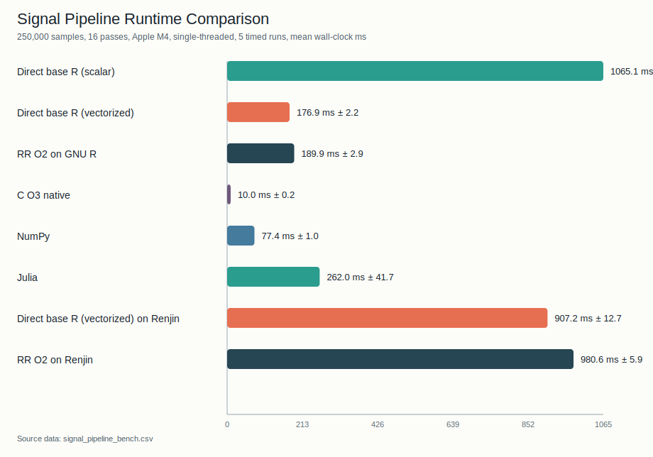

# Testing and Quality Gates

This page is the verification manual for RR.

RR uses:

- unit tests
- integration tests
- emitted-artifact regressions
- runtime parity tests
- benchmark smoke tests
- fuzzing
- audit scripts

The goal is not just “did it compile?” but:

- did meaning stay the same?
- did emitted R keep the expected shape?
- did runtime helper policy stay intact?
- did optimization stay within budget?

## Prerequisites

Most Rust-only tests need only `cargo`.
Tests that execute generated R require `Rscript` in `PATH`.

## Primary Commands

Run the standard local verification stack:

```bash
cargo fmt --all --check
cargo test -q
cargo clippy --all-targets -- -D warnings
```

Run one focused suite:

```bash
cargo test -q --test vectorization_extended
cargo test -q --test case_regressions
```

For the post-change audit pass used before merging compiler work, see
[Contributing Audit Checklist](contributing-audit.md).

Audit helper:

```bash
scripts/contributing_audit.sh
scripts/contributing_audit.sh --scan-only
```

Cleanroom strict verification helper:

```bash
scripts/verify_cleanroom.sh
scripts/verify_cleanroom.sh --files src/syntax/parse.rs tests/statement_boundaries.rs
scripts/verify_cleanroom.sh --fast --files scripts/verify_cleanroom.sh
```

This creates a detached clean worktree at `HEAD`, overlays only the selected
current-tree files, and runs the strict local verification stack there. Use it
when your main worktree is already dirty and you want a verification result that
matches a clean checkout plus only the patch you intend to review. `--fast`
keeps the cleanroom setup but limits execution to `fmt`, `check`, `clippy`, and
the contributing audit.

GitHub Actions runs the diff-scoped `--scan-only` variant on each PR/push so
new work cannot introduce fresh `CONTRIBUTING.md` rule violations unnoticed.

## Test Taxonomy

The test tree is intentionally layered like the manuals:

- frontend and language acceptance
- semantic/runtime rejection
- optimizer and emitted-artifact regressions
- runtime execution parity
- example and benchmark coverage
- fuzz and soak coverage

Use the lightest layer that catches the bug you are fixing.

## Test Families

### File-Based Compiler Regressions

- `tests/cases/*`
- `tests/case_regressions.rs`

This is the fast path for adding small compiler regressions without creating a
new Rust integration test file each time. Cases are grouped by category
(`parser`, `semantic`, `typeck`, `optimizer`, `docs`) and use a tiny
line-oriented `case.meta` sidecar to describe expectations such as:

- `parse-error`
- `semantic-error`
- `type-error`
- `compile-ok`
- `run-equal-o0-o2`

The harness can also assert on compile stdout/stderr, emitted R substrings, and
per-case environment variables. Use it for narrow bug repros, optimizer shape
checks, and doc/example sync cases. The in-tree format reference lives in
`tests/cases/README.md` at the repository root.

### Frontend and Syntax

- `syntax_errors.rs`
- `parse_multi_errors.rs`
- `statement_boundaries.rs`

These cover parsing, error recovery, and syntax diagnostics.

### Semantic and Runtime Static Validation

- `semantic_errors.rs`
- `random_error_diagnostics.rs`
- `runtime_static_errors.rs`
- `multi_errors.rs`
- `commercial_negative_corpus.rs`

These focus on compile-time rejection and aggregated diagnostics.

### Language and Lowering

- `support_expansion.rs`
- `lambda_closure.rs`
- `mir_lowering_loop_match.rs`

These verify that accepted language forms lower correctly into MIR/codegen.

### Optimization Correctness

- `vectorization_extended.rs`
- `vectorization_phi_ifelse.rs`
- `vectorization_lt_bound.rs`
- `vectorization_callmap_slice.rs`
- `vectorization_conditional_slice.rs`
- `vectorization_invariant_fill.rs`
- `vectorization_multi_shadow.rs`
- `vectorization_shadow_last.rs`
- `benchmark_vectorization.rs`
- `bce_shifted_index.rs`
- `sccp_overflow_regression.rs`
- `opt_level_equivalence.rs`
- `r_output_optimization_audit.rs`
- `rr_logic_equivalence_matrix.rs`

These guard optimizer semantics, emitted R shape, and no-panic behavior under aggressive optimization.
Shape-sensitive optimizer suites usually compile with `--no-incremental` so the
asserted emitted R reflects the current optimizer run instead of a reused cache
artifact from the default incremental `auto` mode.

### Incremental Compile and Cache Correctness

- `incremental_phase1.rs`
- `incremental_phase2.rs`
- `incremental_phase3.rs`
- `incremental_auto.rs`
- `incremental_strict_verify.rs`
- `cli_incremental_default.rs`

These validate artifact cache invalidation, function emit reuse, in-memory watch
session reuse, default `auto` phase selection, and strict cache verification.

### CLI and Execution Behavior

- `cli_commands.rs`
- `parallel_cli_flags.rs`
- `parallel_optional_fallback_semantics.rs`

These cover command wiring, mode flags, and backend fallback behavior.

### Stress and Determinism

- `commercial_determinism.rs`
- `commercial_stress_differential.rs`
- `random_differential.rs`
- `pass_verify_examples.rs`
- `reduction_user_call_regression.rs`

These exercise larger workloads and determinism-sensitive paths.
`random_differential.rs` additionally generates small deterministic RR programs,
executes a hand-written reference R version, and compares `-O0/-O1/-O2`
artifacts against the same reference output. `pass_verify_examples.rs` forces
`RR_VERIFY_EACH_PASS=1` on representative examples so verifier regressions show
up at the exact pass boundary instead of only at final emission time.

### Performance Gate

- `perf_regression_gate.rs`

This enforces compile-time budget expectations for optimized builds.

### Example Catalog and Bench Workloads

- `example/data_science/*.rr`
- `example/physics/*.rr`
- `tests/example_simulations.rs`
- `tests/tesseract_runtime_smoke.rs`
- `example/benchmarks/*.rr`
- `tests/benchmark_examples_smoke.rs`
- `tests/example_perf_smoke.rs` (`ignored`)

The simulation catalog is compiled across optimization levels and executed at `-O2`.
The benchmark catalog is intended for repeatable compile-time and runtime comparisons.
`tesseract.rr` is covered as a dedicated runtime smoke because it exercises the
largest vectorization and runtime-injection path in the example set.
The perf smoke compiles the normal runtime-injected artifact; it does not use
`--no-runtime`. Runtime timing is measured with `RR_RUNTIME_MODE=release` and
`RR_ENABLE_MARKS=0` so the gate tracks the fast runtime path instead of debug
marking overhead. Use `--no-runtime` only when the test is inspecting
helper-only emitted R without source/native bootstrap; helper-only output now
injects only the runtime helper subset actually referenced by the emitted code.

Benchmark runner:

```bash
scripts/bench_examples.sh
```

Explicit perf smoke runner:

```bash
cargo test -q --test example_perf_smoke -- --ignored --nocapture
```

Optional perf smoke budgets:

- `RR_EXAMPLE_PERF_TOTAL_COMPILE_O2_MS`
- `RR_EXAMPLE_PERF_TOTAL_RUNTIME_O2_MS`
- `RR_EXAMPLE_PERF_MAX_CASE_RUNTIME_O2_MS`

Current CI baseline:

- total compile `-O2` budget: `6500 ms`
- total runtime `-O2` budget: `30000 ms`
- max single-case runtime `-O2` budget: `30000 ms`

These perf budgets are calibrated against the current hosted CI runner and are
intended as smoke thresholds rather than machine-independent benchmarks. If the
GitHub Actions image or toolchain changes materially, recalibrate the budgets
from a fresh CI sample before tightening them again.

## Local Runtime Comparison Notes

These notes preserve a small set of local runtime comparisons that were
originally gathered for the paper draft. Treat them as workload-specific sanity
checks, not as a general benchmark campaign.

Measurement setup:

- host: Apple M4 with 24 GiB RAM
- GNU R path: `Rscript 4.5.2`
- alternative runtime: Renjin `3.5-beta76` on OpenJDK `25.0.2`
- repeated RR delta study: 5 runs per workload, median runtime with IQR in `()`
- GNU R JIT / Renjin slices: mean runtime with standard deviation in `+-`
- current cross-language slice refresh: GNU R, a local NumPy venv under
  `target/tmp/bench-python`, Homebrew Julia `1.12.5`, and a local Renjin
  `3.5-beta76` install under `target/tmp/renjin-dist`

### Cross-Language Signal Pipeline Slice

For a current end-to-end spot check, `scripts/bench_signal_pipeline.py` now:

- compiles `example/benchmarks/signal_pipeline_bench.rr`
  to RR O2 emitted R
- benchmarks the same deterministic 250k-sample preprocessing kernel across
  scalar base R on GNU R, vectorized base R on GNU R, RR O2 on GNU R, native C,
  NumPy, Julia, vectorized base R on Renjin, and RR O2 on Renjin
- validates that every engine agrees on the final tail value and mean within
  tight floating-point tolerance before timing anything

Reproduction command:

```bash
target/tmp/bench-python/bin/python3 scripts/bench_signal_pipeline.py \
  --runs 5 \
  --warmup 1
```

Artifacts:

- raw data: [`signal-pipeline-runtime-2026-03-11.csv`](./assets/signal-pipeline-runtime-2026-03-11.csv)
- chart:



This slice used `target/release/RR` with `-O2 --no-incremental`, one warmup
run, then five timed wall-clock runs per command. All engines were pinned to a
single thread with `OMP_NUM_THREADS=1`, `OPENBLAS_NUM_THREADS=1`,
`VECLIB_MAXIMUM_THREADS=1`, and `JULIA_NUM_THREADS=1`.

| Slice | Mean ms | Std ms | Notes |
| --- | ---: | ---: | --- |
| direct base R (scalar) on GNU R | `1065.1` | `11.0` | loop-based scalar base-R baseline |
| direct base R (vectorized) on GNU R | `176.9` | `2.2` | idiomatic base-R vector baseline |
| RR O2 emitted R on GNU R | `189.9` | `2.9` | same workload compiled from RR |
| C O3 native | `10.0` | `0.2` | `clang -O3`, single-threaded |
| NumPy | `77.4` | `1.0` | vectorized array math on CPython + NumPy `2.4.3` |
| Julia | `262.0` | `41.7` | Julia `1.12.5`, base loops with `@inbounds` |
| direct base R (vectorized) on Renjin | `907.2` | `12.7` | same idiomatic base-R script on Renjin `3.5-beta76` |
| RR O2 on Renjin | `980.6` | `5.9` | RR-emitted R on Renjin `3.5-beta76` |

Notes:

- The benchmark is deliberately easier to explain than `tesseract`: it models a
  common preprocessing kernel with clamp/threshold/nonlinear feature shaping
  over `250,000` samples and `16` passes.
- The GNU R baseline is now split in two on purpose:
  a scalar loop version and an idiomatic vectorized version.
  That makes the comparison easier to read.
  RR O2 is faster than the scalar direct-R baseline on this workload
  (`1065.1 ms -> 189.9 ms`, about `5.61x`) and now lands close to the
  hand-vectorized base-R script (`176.9 ms`, about `1.07x` gap).
- The fast direct-R row is not a naive translation.
  It is already the shape GNU R likes best: `pmax(...)`, `ifelse(...)`,
  whole-vector assignments, and `mean(...)` on full vectors.
- Renjin handled the vectorized base-R script and the RR-emitted R script on
  the same workload. On this machine RR O2 on Renjin (`980.6 ms`) now sits
  close to vectorized base R on Renjin (`907.2 ms`), though GNU R remains the
  faster host for this emitted program.
- C stayed the native ceiling on this machine, and NumPy was the fastest of the
  managed-language rows.

RR optimization-level deltas on representative workloads:

| Workload | O0 ms | O1 ms | O2 ms | O1/O0 | O2/O0 |
| --- | ---: | ---: | ---: | ---: | ---: |
| `bootstrap` | `167 (2)` | `157 (4)` | `159 (1)` | `1.06x` | `1.05x` |
| `heat` | `194 (3)` | `138 (3)` | `138 (7)` | `1.41x` | `1.41x` |
| `orbital` | `172 (5)` | `165 (10)` | `169 (1)` | `1.04x` | `1.02x` |
| `reaction` | `316 (17)` | `289 (12)` | `287 (9)` | `1.09x` | `1.10x` |
| `vector` | `275 (8)` | `145 (4)` | `143 (6)` | `1.90x` | `1.92x` |
| `tesseract` | `15147 (388)` | `2745 (136)` | `2753 (174)` | `5.52x` | `5.50x` |
| `total` | `16366 (379)` | `3693 (200)` | `3700 (189)` | `4.43x` | `4.42x` |

Notes:

- `-O1` and `-O2` currently route through the same optimized pipeline, so the
  small differences above are run-to-run variation rather than distinct
  rewrite families.
- The clearest wins come from workloads whose scalar loops are rewritten into
  vector-style emitted R shapes.

Small GNU R bytecode/JIT comparison on emitted RR programs:

| Workload | O0 `Rscript` | O0 + JIT | O2 `Rscript` | O2 + JIT |
| --- | ---: | ---: | ---: | ---: |
| `vector` | `282.4 +- 3.0` | `239.2 +- 4.2` | `138.3 +- 1.4` | `116.6 +- 1.6` |
| `tesseract` | `14733.3 +- 171.3` | `15252.3 +- 172.6` | `2786.6 +- 21.3` | `2649.9 +- 53.4` |

Small Renjin comparison on the same emitted RR programs:

| Workload | O0 Renjin | O2 Renjin | O2/O0 |
| --- | ---: | ---: | ---: |
| `vector` | `1256.3 +- 158.6` | `528.5 +- 6.1` | `2.38x` |
| `tesseract` | `38830.6 +- 472.5` | `8259.9 +- 21.3` | `4.70x` |

Takeaways:

- GNU R's bytecode/JIT path helps on some emitted workloads, but the larger
  effect still comes from RR changing the emitted program shape before GNU R
  executes it.
- Renjin is slower in absolute terms on these kernels, but RR's optimized
  emitted output still moves in the same direction there.
- Keep using `tests/example_perf_smoke.rs` and the CI perf gate as the primary
  maintained signal; the tables here are versioned local notes only.

## Golden Semantics

`tests/golden.rs` compares RR-compiled output against reference R behavior for cases in `tests/golden/`.

Requirements:

- `Rscript` available in `PATH`

If `Rscript` is unavailable, golden tests skip automatically.

Promoted example-derived golden cases include:

- `bootstrap_mean`
- `logistic_ensemble`
- `markov_weather_chain`
- `monte_carlo_pi`
- `sir_epidemic`

Each promoted case must include an explicit `.R` baseline. The test no longer
falls back to `-O0` RR output when a reference script is missing.

## RR vs R Differential Matrix

`tests/rr_logic_equivalence_matrix.rs` compares hand-written RR programs against reference R scripts across:

- optimization level: `-O0`, `-O1`, `-O2`
- type mode: `strict`, `gradual`
- native backend mode: `off`, `optional`

Compared outputs:

- process exit code
- normalized stdout
- normalized stderr

`tests/random_differential.rs` extends this with generated programs. Each case
is emitted as both RR and reference R, then executed under `-O0`, `-O1`, and
`-O2` with `RR_VERIFY_EACH_PASS=1`. This is the closest thing in-tree to
translation validation for optimizer changes.

Each persisted failure bundle now carries a machine-readable `bundle.manifest`
file. Triage and promotion scripts validate that manifest before generating
regression skeletons, so nightly automation fails closed instead of silently
processing malformed bundles.

Run only the generated differential suite:

```bash
cargo test -q --test random_differential
RR_RANDOM_DIFFERENTIAL_COUNT=12 RR_RANDOM_DIFFERENTIAL_SEED=0xA11CE5EED55AA11C cargo test -q --test random_differential
RR_RANDOM_DIFFERENTIAL_COUNT=12 RR_RANDOM_DIFFERENTIAL_SEED=0x5EED123456789ABC cargo test -q --test random_differential
RR_RANDOM_DIFFERENTIAL_COUNT=72 cargo test -q --test random_differential -- --nocapture
RR_RANDOM_DIFFERENTIAL_SEED=0xA11CE5EED55AA11C cargo test -q --test random_differential -- --nocapture
```

The default CI workflow runs two smaller deterministic differential slices:

- `RR_RANDOM_DIFFERENTIAL_COUNT=12`, `RR_RANDOM_DIFFERENTIAL_SEED=0xA11CE5EED55AA11C`
- `RR_RANDOM_DIFFERENTIAL_COUNT=12`, `RR_RANDOM_DIFFERENTIAL_SEED=0x5EED123456789ABC`

The generator currently covers:

- branch-heavy vector folds
- scalar recurrences
- matrix row/column aggregation
- nested loops
- call chains
- tail recursion
- record mutation / field access
- direct `stats` / `base` namespace interop

On mismatch, `random_differential.rs` writes a failure bundle under
`target/tests/random_differential_failures/` with:

- `case.rr`
- `reference.R`
- emitted `compiled.R`
- stdout/stderr for reference and compiled runs
- `bundle.manifest`
- `README.txt`

Nightly differential soak additionally triages those bundles into
`.artifacts/differential-triage/` with:

- `summary.md`
- `job-summary.md`
- `summary.json`
- copied bundle inputs and outputs
- generated `regression.rs` skeletons
- a nightly `cargo test` smoke run of those generated skeletons

Promote a triaged bundle into a checked-in regression test with:

```bash
scripts/promote_differential_regression.sh .artifacts/differential-triage/<bundle-dir>
scripts/triage_driver.sh promote differential .artifacts/differential-triage/<bundle-dir>
```

## Performance Knobs

`tests/perf_regression_gate.rs` uses:

- `RR_PERF_GATE_MS` (default `12000`)
- `RR_PERF_O2_O1_RATIO` (default `12`)

Adjust these only when you intentionally re-baseline compile-time expectations.

## Per-Pass Verification

`RR_VERIFY_EACH_PASS=1` runs the MIR verifier after each optimization pass.
This is slower, but it is the right mode when validating optimizer changes or
reproducing a suspected miscompile.

Example:

```bash
RR_VERIFY_EACH_PASS=1 cargo test -q --test pass_verify_examples
RR_VERIFY_EACH_PASS=1 cargo run -- example/tesseract.rr -O2 -o /tmp/tesseract.R
```

If `pass_verify_examples` fails, it writes a repro bundle under
`target/tests/pass_verify_failures/` with:

- `case.rr`
- `compiler.stdout`
- `compiler.stderr`
- emitted `compiled.R` when codegen completed
- copied verifier dumps under `verify-dumps/` when available

Nightly soak triages those bundles into `.artifacts/pass-verify-triage/` and
generates `regression.rs` skeletons, then runs a nightly `cargo test` smoke
over those generated tests. Promote one into a checked-in regression test with:

```bash
scripts/promote_pass_verify_regression.sh .artifacts/pass-verify-triage/<bundle-dir>
scripts/triage_driver.sh promote pass-verify .artifacts/pass-verify-triage/<bundle-dir>
```

## Fuzzing

Targets:

- `fuzz/fuzz_targets/parser.rs`
- `fuzz/fuzz_targets/pipeline.rs`
- `fuzz/fuzz_targets/type_solver.rs`
- `fuzz/fuzz_targets/incremental.rs` (`incremental_compile`)
- `fuzz/fuzz_targets/generated_pipeline.rs` (`generated_pipeline`)
- `fuzz/fuzz_targets/error_diagnostics.rs` (`error_diagnostics`)

Dictionary:

- `fuzz/dictionaries/rr.dict`

Run:

```bash
cargo install cargo-fuzz --locked
cargo +nightly fuzz run parser fuzz/corpus/parser -- -dict=fuzz/dictionaries/rr.dict -max_total_time=60
cargo +nightly fuzz run pipeline fuzz/corpus/pipeline -- -dict=fuzz/dictionaries/rr.dict -max_total_time=60
cargo +nightly fuzz run type_solver fuzz/corpus/type_solver -- -dict=fuzz/dictionaries/rr.dict -max_total_time=60
cargo +nightly fuzz run incremental_compile fuzz/corpus/incremental_compile -- -dict=fuzz/dictionaries/rr.dict -max_total_time=60
cargo +nightly fuzz run generated_pipeline fuzz/corpus/generated_pipeline -- -dict=fuzz/dictionaries/rr.dict -max_total_time=60
cargo +nightly fuzz run error_diagnostics fuzz/corpus/error_diagnostics -- -dict=fuzz/dictionaries/rr.dict -max_total_time=60
```

`generated_pipeline` differs from the raw parser/pipeline targets: it decodes
a small seed, generates valid RR programs, and then drives the optimizer,
verifier, and codegen on those generated programs. Use it when you want
valid-program stress instead of arbitrary malformed input stress.

Longer soak coverage runs separately in
`.github/workflows/nightly-soak.yml`:

- larger `random_differential` suites
- longer `error_diagnostics` fuzz runs
- longer `pipeline`, `incremental_compile`, and `generated_pipeline` fuzz runs
  at `-max_total_time=300`
- uploaded differential soak logs
- uploaded fuzz logs and any crash artifacts for local replay
- uploaded triage summaries with minimized crash inputs and replay commands
- uploaded verifier dumps from `RR_VERIFY_EACH_PASS=1` failures

Smoke runner:

```bash
scripts/fuzz_smoke.sh
```

By default this uses `fuzz/corpus_smoke/*` so that smoke runs stay bounded.
Set `FUZZ_CORPUS_ROOT=fuzz/corpus` when you want to run against the full corpus set.
The smoke script forces `RR_QUIET_LOG=1` so compiler progress output does not drown
out libFuzzer stats, coverage changes, and crash reports.

Replay a pipeline crash artifact:

```bash
cargo +nightly fuzz run pipeline fuzz/artifacts/pipeline/crash-<hash> -- -runs=1 -rss_limit_mb=2048
cargo +nightly fuzz tmin pipeline fuzz/artifacts/pipeline/crash-<hash>
```

Generate a local triage report from any crash artifacts:

```bash
scripts/fuzz_triage.sh
scripts/triage_driver.sh triage fuzz
```

This script:

- replays each crash once to confirm reproducibility
- copies and minimizes the input with `cargo fuzz tmin`
- writes replay commands and per-case logs into `.artifacts/fuzz-triage/summary.md`
- writes a compact CI-friendly table into `.artifacts/fuzz-triage/job-summary.md`
- writes machine-readable counts and case metadata into `.artifacts/fuzz-triage/summary.json`
- generates either `regression.rs` (plain RR text input) or `regression.md`
  (non-text/manual replay case) per artifact
- nightly soak also runs `cargo test` smoke over generated `regression.rs` cases

Promote a generated triage case into the repository test suite:

```bash
scripts/promote_fuzz_regression.sh .artifacts/fuzz-triage/pipeline_crash_<hash>
scripts/triage_driver.sh promote fuzz .artifacts/fuzz-triage/pipeline_crash_<hash>
```

For text RR inputs this copies:

- `minimized-input` -> `tests/fuzz_regressions/<name>.rr`
- `regression.rs` -> `tests/<name>.rs`

For non-text cases it creates a manual replay note under
`tests/fuzz_regressions/manual_<name>/`.

## CI Expectations

The CI workflow is expected to run:

- Rust test suite
- R-backed integration coverage
- dedicated differential test coverage against reference R
- per-pass verifier smoke with `RR_VERIFY_EACH_PASS=1`
- dedicated example perf smoke with timing output
- linting
- fuzz smoke coverage for key targets
- incremental fuzz smoke coverage

The example-heavy runtime suites run in a dedicated CI job so failures in
`example_simulations`, `benchmark_examples_smoke`, or `tesseract_runtime_smoke`
do not get buried inside the core Rust test log.

For compiler changes, targeted regression tests are preferred over broad snapshot updates.
Use [Contributing Audit Checklist](contributing-audit.md) as the final manual sign-off pass.

## Unified Triage Driver

The preferred local entrypoint for triage automation is:

```bash
scripts/triage_driver.sh triage differential
scripts/triage_driver.sh triage pass-verify
scripts/triage_driver.sh triage fuzz
scripts/triage_driver.sh smoke differential .artifacts/differential-triage
scripts/triage_driver.sh promote fuzz .artifacts/fuzz-triage/<case-dir>
```

The underlying scripts remain available for focused debugging, but the driver
keeps nightly and local workflows aligned.

## Triage Artifact Schemas

Persisted failure bundles now use a versioned manifest contract:

```text
schema: rr-triage-bundle
version: 1
kind: fuzz|differential|pass-verify
...
```

Required common fields:

- `schema`
- `version`
- `kind`

Required kind-specific fields:

- `fuzz`
  - `target`
  - `artifact`
  - `repro_status`
  - `tmin_status`
  - `skeleton_kind`
- `differential`
  - `case`
  - `opt`
  - `reference_status`
  - `compiled_status`
- `pass-verify`
  - `case`
  - `status`

Triage outputs also write a machine-readable report:

```json
{
  "schema": "rr-triage-report",
  "version": 1,
  "kind": "fuzz|differential|pass-verify",
  "cases": []
}
```

Nightly soak then aggregates those per-kind reports into:

- `.artifacts/nightly-soak/verification-summary.json`
- `.artifacts/nightly-soak/verification-summary.md`
- `.artifacts/nightly-soak/top-promotion-candidates.json`
- `.artifacts/nightly-soak/top-promotion-candidates.md`

The markdown summary also includes a conservative `Promotion Candidates`
section. A case appears there only when nightly produced a checked-in-test
capable `regression.rs` skeleton for that bundle. Candidates are ranked with a
stable priority policy so the top of the nightly summary points at the most
actionable regressions first:

- `pass-verify`: critical
- `differential`: critical/high depending on exit-status divergence
- `fuzz`: high/medium depending on replay and minimization quality

The aggregate report uses:

```json
{
  "schema": "rr-verification-summary",
  "version": 1,
  "sources": { ... },
  "differential": { ... },
  "pass_verify": { ... },
  "fuzz": { ... },
  "totals": { ... }
}
```

It also records the nightly run context when GitHub Actions metadata is
available:

- `github_run_id`
- `github_run_attempt`
- `github_workflow`
- `github_job`
- `github_ref_name`
- `github_sha`

and summarizes:

- `differential_by_opt`
- `fuzz_by_target`
- `promotion_candidates_by_kind`
- `promotion_candidates_by_severity`

Generate it locally from existing triage outputs with:

```bash
bash scripts/verification_summary.sh .artifacts .artifacts/nightly-soak
```

That summary emits promote-ready commands such as:

```bash
scripts/triage_driver.sh promote differential .artifacts/differential-triage/<bundle-dir>
scripts/triage_driver.sh promote pass-verify .artifacts/pass-verify-triage/<bundle-dir>
scripts/triage_driver.sh promote fuzz .artifacts/fuzz-triage/<case-dir>
```

The separate `top-promotion-candidates.*` files are intended for downstream
automation or notification hooks that only need the highest-priority promote
targets instead of the full nightly report.
